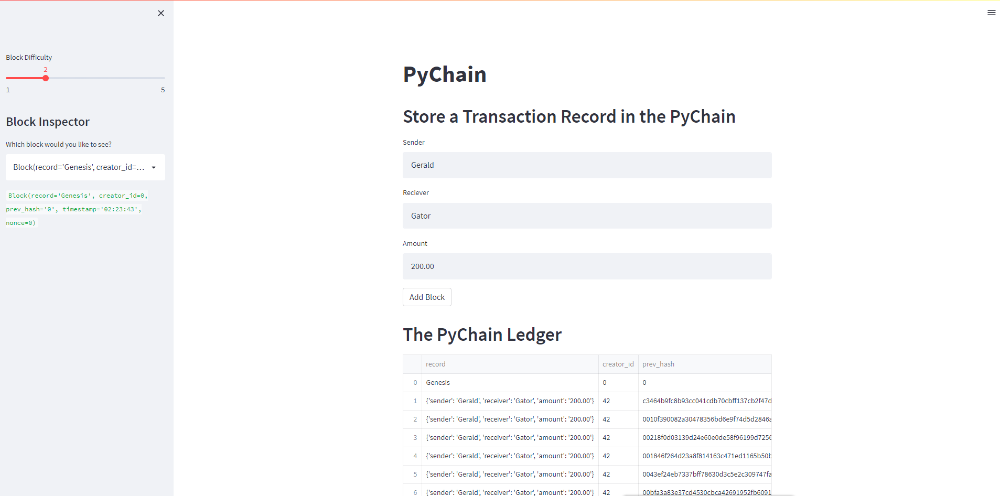

# Unit-18-Blockchain

# Initial imports

import streamlit as st

from dataclasses import dataclass

from typing import Any, List

import datetime as datetime

import pandas as pd

import hashlib

After our initial imports and coding, we save our file and copy its path. We then run the program with the command "streamlit run" followed by the path to the file that we copied. streamlit run "Documents/GitHub/ASU-VIRT-FIN-PT-03-2022-U-LOL/18-Blockchain/Homework/Starter_Code/pychain.py"
